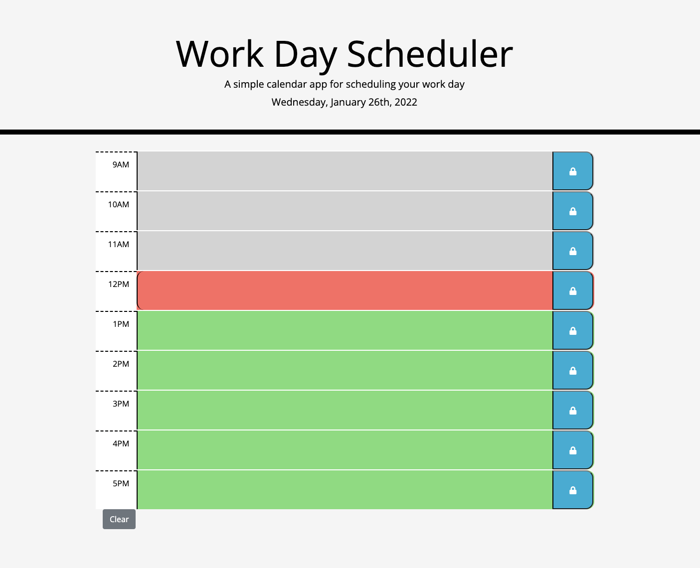
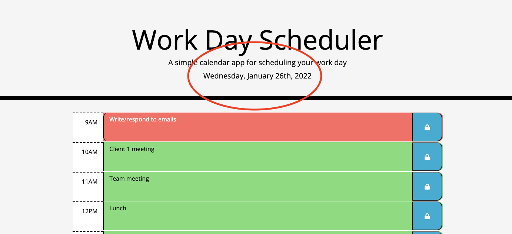
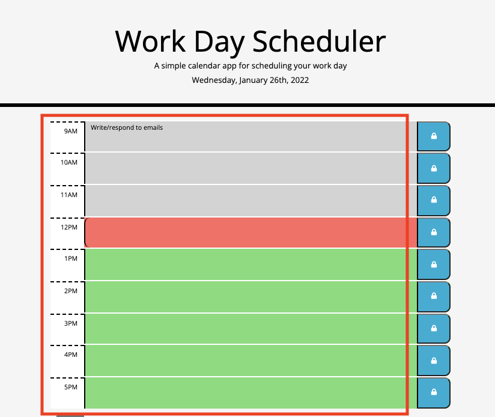
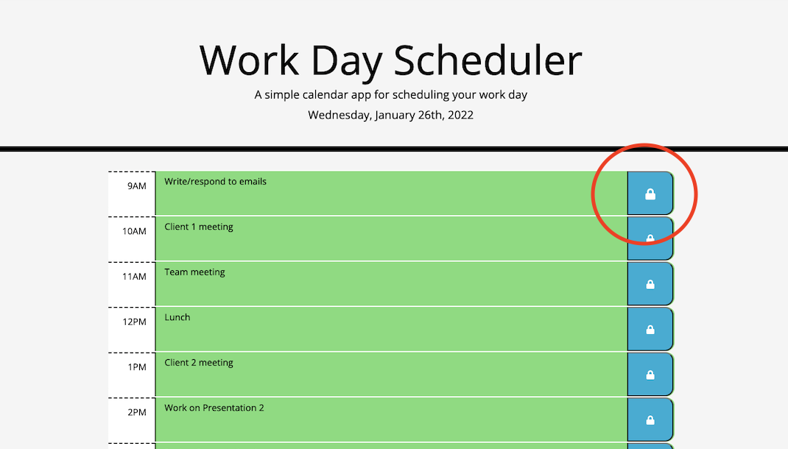
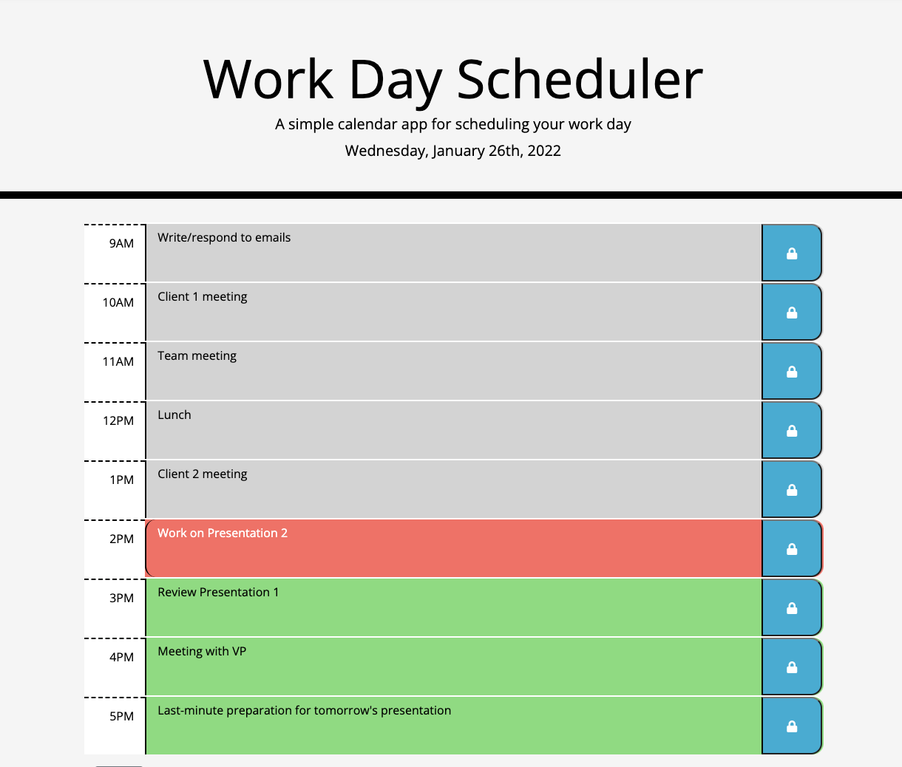

# 05 Third-Party APIs: Work Day Scheduler

## Description

This project aims to create a simple calendar application that allows a user to save events for each hour of the day by modifying starter code. The application will run in the browser and feature dynamically updated HTML and CSS powered by jQuery. The [Moment.js](https://momentjs.com/) library is used to work with date and time. 

## Installation

This application runs in a browser while its HTML, CSS, JS, images, and README files are accessed through the author's GitHub repository at https://github.com/jbtiglao.

The application has the following user interface:

For review and grading purposes, the application is deployed at https://jbtiglao.github.io/workday-scheduler/. 

## Usage

This application enables an employee (user) with a busy schedule to add important events so the user can manage the user's time effectively.

Following the acceptance criteria required  of the project and the mock-up provided on how the project should function and look like, this application features the following functionalities: 

When a user uses the daily planner to create a schedule:

* When the user opens the planner, the current day is displayed at the top of the calendar. The application uses a date utility library to work with date and time;

* When the user scrolls down, the user is presented with timeblocks for standard business hours;

* When the user views the timeblocks for that day, each timeblock is color-coded to indicate whether it is in the past, present, or future. Past even is in gray, present is in red, and future is in green;

* When the user clicks into a timeblock, the user can enter an event;

* When the user clicks the save button for that timeblock, the text for that event is saved in local storage;

* When the user refreshes the page, the saved events persist.

* The timeblock entry fields are editable, however, the user can use the clear button to clear all contents and the local storage. 

## Credits

The following books, handouts, websites, and other resources were consulted and/or utilized in the development of this project:

* Lectures on Javascript and Third-Party APIs, UCI Coding Bootcamp;

* Unit 3 and Unit 5 handouts on Javascript and Third-Party APIs, UCI Coding Bootcamp;

* Murach's Javascript and jQuery 4th Edition by Mary Delamater and Zak Ruvalcaba, 2020, San Francisco, CA;

* Eloquent Javascript 3rd Edition by Marijn Haverbeke, 2019, San Francisco, CA;

* MDN Web Docs on Javascript and Third-Party APIs;

* https://jQuery.com;

* https://getbootstrap.com;

* https://fontawesome.com for the lock/save icon;

* https://fonts.google.com;

* https://momentjs.com;

* https://stackoverflow.com for troubleshooting and questions on Javascript and jQuery functionalities. 

* https://w3schools.com for Javascript and Third-Party APIs references and tutorials; and

* https://www.youtube.com for Javascript tutorials.